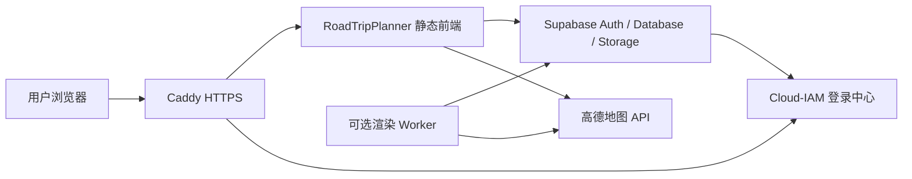

# RoadTripPlanner 部署手册

本文档用于把 RoadTripPlanner 部署到自己的 Debian 12 服务器。前端由 Caddy 提供 HTTPS 和静态文件服务，Cloud-IAM 负责用户注册、登录、找回密码和修改密码，Supabase 负责数据库、对象存储、权限隔离和登录会话接入。

示例域名：

```text
map.bestapi.best       # RoadTripPlanner 网站
auth.bestapi.best      # 可选：Cloud-IAM 自定义域名
```

所有密钥和密码都使用占位符。不要把真实密钥提交到 Git。

## 1. 部署架构



核心分工：

| 模块 | 用途 |
| --- | --- |
| Caddy | 自动 HTTPS、静态网站服务 |
| Cloud-IAM | 用户注册、用户名密码登录、忘记密码邮件找回、修改密码 |
| Supabase Auth | 接入 Cloud-IAM OIDC，给前端提供登录态 |
| Supabase Database | 保存用户路线、共享景点、站点配置 |
| Supabase Storage | 保存导出文件和用户文件 |
| 渲染 Worker | 可选，用于后台生成路线图、Markdown、PDF、MP4 |

## 2. 域名解析

在你的 DNS 服务商中添加：

```text
map.bestapi.best    A        <服务器公网 IPv4>
auth.bestapi.best   CNAME    <Cloud-IAM 要求的目标域名>
```

`auth.bestapi.best` 只有在 Cloud-IAM 支持并启用自定义域名时才需要配置。没有自定义域名时，直接使用 Cloud-IAM 分配的默认域名即可。

如果服务器有 IPv6，可以给 `map.bestapi.best` 额外添加 AAAA 记录。解析生效后再继续配置 Caddy，Caddy 会自动申请网站 HTTPS 证书。

## 3. Debian 12 基础环境

登录服务器后执行：

```bash
sudo apt update
sudo apt upgrade -y
sudo apt install -y git curl ca-certificates gnupg unzip rsync ufw caddy
sudo systemctl enable --now caddy
```

安装 Docker：

```bash
curl -fsSL https://get.docker.com | sudo sh
sudo apt install -y docker-compose-plugin
sudo usermod -aG docker $USER
```

退出 SSH 后重新登录，让 docker 用户组生效。

安装 Node.js 22：

```bash
curl -fsSL https://deb.nodesource.com/setup_22.x | sudo -E bash -
sudo apt install -y nodejs
node -v
npm -v
```

建议开启防火墙，仅放行 SSH、HTTP、HTTPS：

```bash
sudo ufw allow OpenSSH
sudo ufw allow 80/tcp
sudo ufw allow 443/tcp
sudo ufw enable
```

## 4. 配置 Cloud-IAM

Cloud-IAM 是托管 Keycloak 服务，不需要在你的 Debian 服务器上部署身份服务。服务器只负责 RoadTripPlanner 前端、Caddy 和可选渲染 Worker。

登录 Cloud-IAM 控制台后，创建或确认一个 Keycloak 实例，并记录它的访问地址：

```text
Cloud-IAM Base URL: https://lemur-8.cloud-iam.com/auth
```

如果你已经在 Cloud-IAM 配置了自定义域名，可以使用：

```text
Cloud-IAM Base URL: https://auth.bestapi.best/auth
```

当前项目的 Cloud-IAM Deployment 名称为 `roadtrip-planner`，Cloud-IAM 已自动创建同名 realm。后续所有 `Issuer URL` 和账户中心地址都从这个 Base URL 与 realm 推导。

## 5. 配置 Cloud-IAM Realm 和 Client

在 Cloud-IAM 打开 Keycloak Admin Console，创建或确认：

```text
Realm: roadtrip-planner
Client ID: roadtrip-map
```

Client 建议配置：

| 字段 | 值 |
| --- | --- |
| Client type | OpenID Connect |
| Client ID | `roadtrip-map` |
| Client authentication | On |
| Authorization | Off |
| Standard flow | On |
| Direct access grants | Off |
| Valid redirect URIs | `https://<你的 Supabase Project Ref>.supabase.co/auth/v1/callback` |
| Valid post logout redirect URIs | `https://map.bestapi.best/*` |
| Web origins | `https://map.bestapi.best` |

保存后，在 Client 的 Credentials 页面记录：

```text
Client ID: roadtrip-map
Client Secret: <Cloud-IAM 生成的 secret>
Issuer URL: <Cloud-IAM Base URL>/realms/roadtrip-planner
Account Console: <Cloud-IAM Base URL>/realms/roadtrip-planner/account/
```

建议创建站点管理员用户：

```text
username: admin
email: admin@map.bestapi.best
```

站点会把满足以下任一条件的登录用户识别为 admin：

```text
email = admin@map.bestapi.best
preferred_username = admin
username = admin
name = admin
```

admin 可以维护高德地图 Key。普通用户只能读取站点地图配置，不能修改，也不能看到 admin 的测试路线。

## 6. 配置 Supabase

### 6.1 执行数据库迁移

在 Supabase Dashboard 打开 SQL Editor，按顺序执行：

```text
app/cloud/supabase/migrations/001_initial_schema.sql
app/cloud/supabase/migrations/002_cloud_exports.sql
app/cloud/supabase/migrations/003_app_settings.sql
app/cloud/supabase/migrations/004_oidc_admin.sql
```

迁移用途：

| 文件 | 用途 |
| --- | --- |
| `001_initial_schema.sql` | 用户私有路线、共享景点、基础 RLS |
| `002_cloud_exports.sql` | 导出任务和导出文件桶 |
| `003_app_settings.sql` | 站点配置表，高德 Key 存放处 |
| `004_oidc_admin.sql` | OIDC admin 识别规则 |

### 6.2 配置 Auth URL

进入：

```text
Authentication -> URL Configuration
```

设置：

```text
Site URL: https://map.bestapi.best
Redirect URLs:
  https://map.bestapi.best/**
```

### 6.3 添加 Cloud-IAM OIDC Provider

进入：

```text
Authentication -> Sign In / Providers
```

添加 Custom OAuth/OIDC provider：

```text
Provider name: cloud-iam
Issuer URL: https://lemur-8.cloud-iam.com/auth/realms/roadtrip-planner
Client ID: <Cloud-IAM Application Client ID>
Client Secret: <Cloud-IAM Application Client Secret>
```

前端默认使用：

```text
VITE_SUPABASE_OIDC_PROVIDER=custom:cloud-iam
VITE_IDENTITY_LABEL=Cloud-IAM
VITE_IDENTITY_ACCOUNT_URL=https://lemur-8.cloud-iam.com/auth/realms/roadtrip-planner/account/
```

如果 Supabase 中的 provider 名称不是 `cloud-iam`，需要同步修改前端环境变量。

## 7. 部署网站前端

创建目录并拉取代码：

```bash
sudo mkdir -p /opt/roadtrip
sudo chown -R $USER:$USER /opt/roadtrip
cd /opt/roadtrip
git clone https://github.com/claudemt/RoadTripPlanner.git .
git checkout main
```

安装依赖：

```bash
cd app
npm ci
```

创建生产环境变量：

```bash
nano .env.production
```

填写：

```env
VITE_SITE_NAME=山河路书
VITE_SUPABASE_URL=https://<你的 Supabase Project Ref>.supabase.co
VITE_SUPABASE_PUBLISHABLE_KEY=<你的 Supabase Publishable Key>
VITE_SUPABASE_OIDC_PROVIDER=custom:cloud-iam
VITE_IDENTITY_LABEL=Cloud-IAM
VITE_IDENTITY_ACCOUNT_URL=https://lemur-8.cloud-iam.com/auth/realms/roadtrip-planner/account/

# 生产环境建议由 admin 在网站配置页维护。这里保留为空即可。
VITE_AMAP_KEY=
VITE_AMAP_SECURITY_JS_CODE=
```

构建并发布：

```bash
npm run build
sudo mkdir -p /var/www/roadtrip
sudo rsync -a --delete dist/ /var/www/roadtrip/
sudo chown -R www-data:www-data /var/www/roadtrip
```

配置 Caddy：

```bash
sudo nano /etc/caddy/Caddyfile
```

完整示例：

```caddyfile
map.bestapi.best {
    root * /var/www/roadtrip
    encode zstd gzip

    @static path *.js *.css *.png *.jpg *.jpeg *.gif *.svg *.ico *.webp *.woff *.woff2
    header @static Cache-Control "public, max-age=604800"

    header {
        X-Content-Type-Options nosniff
        Referrer-Policy strict-origin-when-cross-origin
    }

    try_files {path} /index.html
    file_server
}
```

验证并重载：

```bash
sudo caddy validate --config /etc/caddy/Caddyfile
sudo systemctl reload caddy
```

访问：

```text
https://map.bestapi.best
```

点击登录后应跳转到 Cloud-IAM，登录成功后回到网站。

## 8. 配置高德地图 Key

打开高德开放平台，创建 Web 端 JS API Key，并设置 `securityJsCode`。

建议把以下域名加入高德 Web 端白名单：

```text
map.bestapi.best
localhost
127.0.0.1
```

登录网站 admin 后进入个人/配置界面：

```text
填写 Web JS API Key
填写 securityJsCode
保存
```

保存后配置会写入 Supabase `public.app_settings`。普通用户加载地图时只读取这份配置，没有修改权限。

## 9. 可选：部署后台渲染 Worker

如果需要网站端生成路线图、Markdown、PDF、MP4，需要部署 Worker。Worker 不需要开放公网端口，只需要能访问 Supabase 和高德 API。

创建环境文件：

```bash
cd /opt/roadtrip/app
nano worker.env
```

填写：

```env
SUPABASE_URL=https://<你的 Supabase Project Ref>.supabase.co
SUPABASE_SERVICE_ROLE_KEY=<Supabase Service Role Key>
AMAP_KEY=<高德 Web JS API Key>
AMAP_SECURITY_JS_CODE=<高德 securityJsCode>

RENDER_WORKER_ID=roadtrip-render-01
RENDER_POLL_INTERVAL_MS=5000
ROUTE_RENDER_CONCURRENCY=1
ROUTE_RENDER_CRF=20
```

注意：

- `SUPABASE_SERVICE_ROLE_KEY` 只能放在服务器。
- 不要把 Service Role Key 写入任何 `VITE_` 变量。
- 不要提交 `worker.env`。

构建并启动：

```bash
docker build -f worker/Dockerfile -t roadtrip-render-worker .
docker run -d --restart unless-stopped \
  --name roadtrip-render-worker \
  --env-file worker.env \
  roadtrip-render-worker
```

查看日志：

```bash
docker logs -f roadtrip-render-worker
```

更新 Worker：

```bash
cd /opt/roadtrip
git pull
cd app
docker build -f worker/Dockerfile -t roadtrip-render-worker .
docker rm -f roadtrip-render-worker
docker run -d --restart unless-stopped \
  --name roadtrip-render-worker \
  --env-file worker.env \
  roadtrip-render-worker
```

## 10. 更新网站

以后更新前端：

```bash
cd /opt/roadtrip
git pull
cd app
npm ci
npm run build
sudo rsync -a --delete dist/ /var/www/roadtrip/
sudo chown -R www-data:www-data /var/www/roadtrip
sudo caddy validate --config /etc/caddy/Caddyfile
sudo systemctl reload caddy
```

## 11. 上线检查

### 域名与 HTTPS

```bash
curl -I https://map.bestapi.best
```

应返回 200 或 30x，且证书有效。

### Cloud-IAM

- Cloud-IAM Base URL 可以打开。
- 用户可以注册和登录。
- 忘记密码邮件服务已按 Cloud-IAM 的 SMTP 配置完成。
- Cloud-IAM Application 的 Redirect URL 指向 Supabase callback。
- admin 用户的 username 为 `admin`，或 email 为 `admin@map.bestapi.best`。

### Supabase

- 4 个 SQL 迁移均已执行。
- Authentication Site URL 是 `https://map.bestapi.best`。
- Redirect URLs 包含 `https://map.bestapi.best/**`。
- Custom provider 名称与 `VITE_SUPABASE_OIDC_PROVIDER` 匹配。
- `routes` 表 RLS 已开启。
- `scenes` 允许登录用户共同维护。
- `route-exports` bucket 已存在。

### 网站

- 登录页不出现旧的邮箱验证码登录文案。
- 点击登录跳转 Cloud-IAM。
- 登录后能回到网站。
- admin 可以保存高德地图 Key。
- 普通用户不能修改高德地图 Key。
- 普通用户看不到 admin 测试路线。
- 地图、搜索、路线规划功能正常。

### Worker

- 网站点击导出后，Supabase `export_jobs` 出现 queued 任务。
- Worker 日志显示领取任务。
- 任务完成后，个人工作台能看到导出文件。

## 12. 常见问题

### 登录后没有回到网站

检查三处：

```text
Cloud-IAM Redirect URL:
https://<Supabase Project Ref>.supabase.co/auth/v1/callback

Supabase Site URL:
https://map.bestapi.best

前端 provider:
VITE_SUPABASE_OIDC_PROVIDER=custom:cloud-iam
```

### admin 看不到配置入口

确认 Cloud-IAM 返回的用户资料满足任一条件：

```text
email = admin@map.bestapi.best
preferred_username = admin
username = admin
name = admin
```

修改后退出并重新登录。

### 地图加载失败

检查：

- 高德 Key 是否为 Web 端 JS API Key。
- `securityJsCode` 是否正确。
- 高德白名单是否包含 `map.bestapi.best`。
- 浏览器控制台是否提示 referer 或安全密钥错误。

### 普通用户看到 admin 路线

正常情况下不应该发生。检查：

- Supabase `routes` 表是否开启 RLS。
- `routes` policy 是否按 `auth.uid() = user_id` 隔离。
- 是否误把 Supabase Service Role Key 放进前端。

### 页面刷新后 404

确认 Caddy 的 `map.bestapi.best` 配置包含：

```caddyfile
try_files {path} /index.html
```

### Cloud-IAM 打不开

如果使用 Cloud-IAM 默认域名，检查 Cloud-IAM 控制台中的实例状态。如果使用 `auth.bestapi.best` 自定义域名，检查 DNS、Cloud-IAM 自定义域名状态和证书状态。

不要把托管 Cloud-IAM 反向代理到本机 127.0.0.1；它不是运行在你的 Debian 服务器上的服务。

## 13. 备份

建议定期备份：

```text
/opt/roadtrip/app/.env.production
/opt/roadtrip/app/worker.env
/etc/caddy/Caddyfile
```

Supabase 数据建议使用 Dashboard 的备份功能，或定期导出关键表。

## 14. 安全注意

- Cloud-IAM 管理员密码上线前必须修改。
- Cloud-IAM Client Secret 只填写到 Supabase，不要写入前端环境变量。
- Supabase Service Role Key 只能放在服务器。
- 不要提交 `.env.production`、`worker.env`、本地路线数据和私有密钥。
- Debian 定期更新：

```bash
sudo apt update
sudo apt upgrade -y
```
